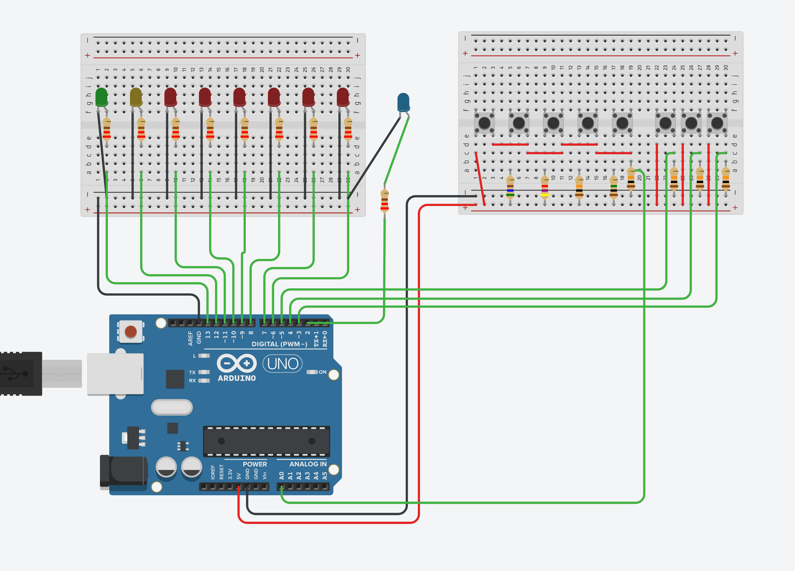

# Arduino Midi Controller (WIP)

## About this project

This project is meant to provide a bluetooth midi controller for the Yamaha THR10II amp, allowing to change presets and toggle effects on & off in a pedalboard.

It features 8 buttons:

- 1 to 5 are used to toggle presets
- 6 to toggle compressor on and off
- 7 to toggle modulation on and off
- 8 to toggle delay on and off

This is still Work in Progress !

- [x] board schematics
- [x] handling of buttons
- [ ] enable bluetooth communication
- [ ] sending midi signal when a button is pressed

## Hardware

- Arduino Uno
- 1 or more breadboards (for prototyping)
- 9 LEDs (colors are up to you)
- 8 4-pins push buttons
- 9 220 Ω resistors
- 5 10 kΩ resistors
- 1 1 MΩ resistor
- 1 4.7 kΩ resistor
- 1 560 Ω resistor
- jumper wires

## Schematic

## The code

see the sketch file and its comments to understand how the code works.
This sketch relies on the [Arduino Buttons Library](https://github.com/f-roland/Arduino-Buttons-lib)
